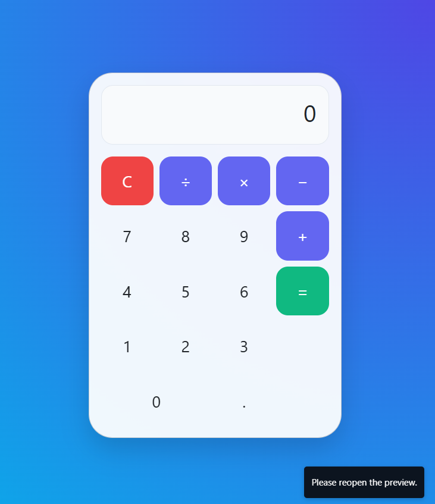

📟 Animated Calculator
A stylish, responsive calculator built with HTML, CSS, Bootstrap 5, and JavaScript. Supports keyboard input, basic arithmetic operations, and animated UI.

🚀 Features
💻 Beautiful glassmorphism design

🎯 Keyboard & button input

🧠 Handles basic arithmetic: +, −, ×, ÷

🔒 Input validation (no double operators)

⚡ Smooth fade-in animation

📱 Responsive layout

📂 File Structure
bash
Copy
Edit
├── index.html # Main calculator layout
├── calc.js # JavaScript logic
└── README.md # Project documentation
🛠️ Technologies
HTML5

CSS3

Bootstrap 5

JavaScript (Vanilla)

🎮 Keyboard Controls
Key Action
0–9 Input digits

- - - / Operators
      . Decimal point
      Enter or = Evaluate
      Escape or C Clear
      Backspace Delete last

📸 Preview

📄 License
MIT License © 2025 — Pradyumna Behera
