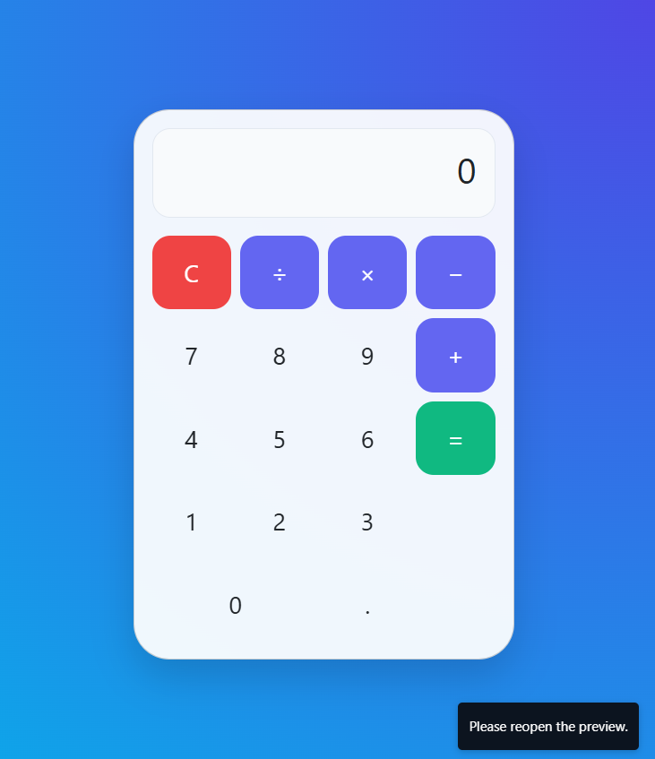

# 📟 Animated Calculator

[](https://opensource.org/licenses/MIT)

A stylish, responsive calculator built with HTML, CSS, Bootstrap 5, and JavaScript. It features a beautiful glassmorphism design, smooth animations, and supports both mouse and keyboard inputs.



## 🚀 Features

- **💻 Modern UI:** Beautiful glassmorphism design.
- **🎯 Dual Input:** Supports both keyboard and mouse/touch input.
- **🧠 Core Arithmetic:** Handles addition (`+`), subtraction (`−`), multiplication (`×`), and division (`÷`).
- **🔒 Input Validation:** Prevents invalid inputs like consecutive operators.
- **⚡ Smooth Animations:** Fade-in animations for a better user experience.
- **📱 Fully Responsive:** Adapts seamlessly to any screen size.

## 🛠️ Technologies Used

- **HTML5**
- **CSS3**
- **Bootstrap 5**
- **JavaScript (Vanilla)**

## 🏁 Getting Started

To get a local copy up and running, follow these simple steps.

1.  Clone the repository 
    ```sh
    git clone https://github.com/pradyumna990-dev/calculator.git
    ```
2.  Navigate to the project directory:
    ```sh
    cd calculator
    ```
3.  Open `index.html` in your favorite web browser.

## 📂 File Structure

```
.
├── index.html      # Main calculator layout (HTML)
├── calc.js         # Core logic (JavaScript)
└── README.md       # Project documentation
```

## 🎮 Keyboard Controls

| Key                | Action                |
| ------------------ | --------------------- |
| `0`–`9`            | Input digits          |
| `+`, `-`, `*`, `/` | Input operators       |
| `.`                | Input decimal point   |
| `Enter` or `=`     | Evaluate expression   |
| `Escape` or `c`    | Clear all input (AC)  |
| `Backspace`        | Delete last character |

## 📄 License

This project is licensed under the MIT License.

Copyright © 2025 — Pradyumna Behera
